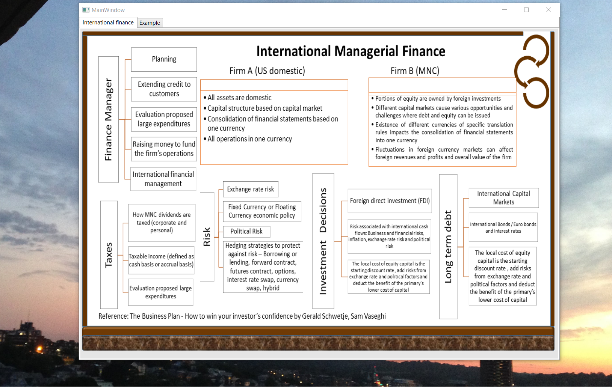
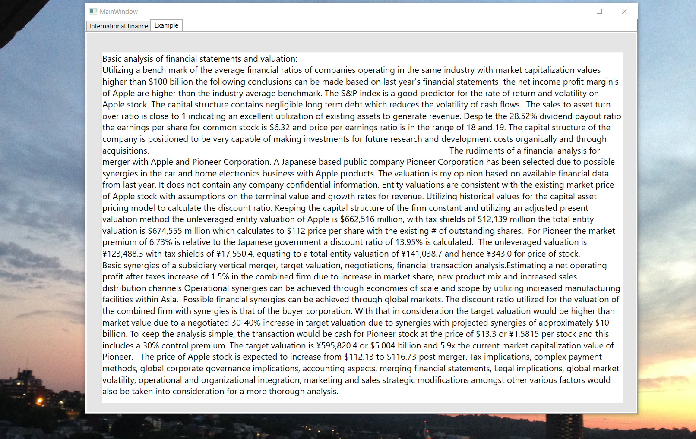

# International Managerial Finance

The project provides an introduction to international managerial finance

Images are custom. Confidential information is not displayed.

Please download the executable in https://github.com/alpaddesai/InternationalManagerialFinance/releases

## International managerial finance

## Mergers

## Investing in foreign markets

## Interest

## Exams

## Copyright Certification

## Ethics

Advanced knowledge : https://github.com/alpaddesai/BusinessLaw 
